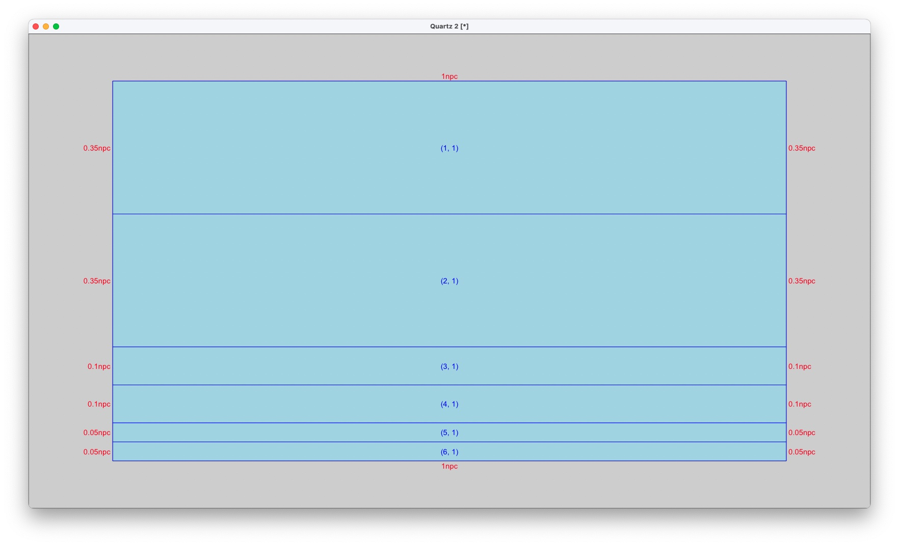
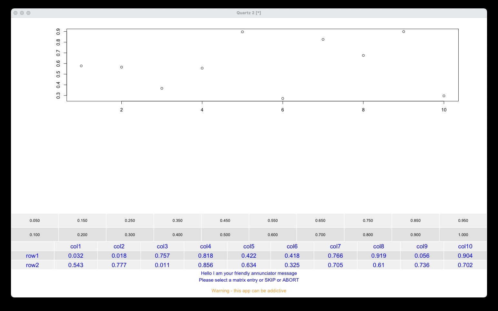
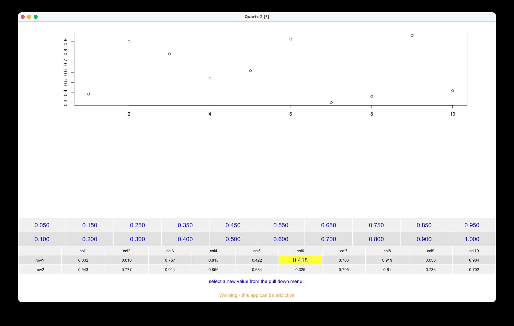
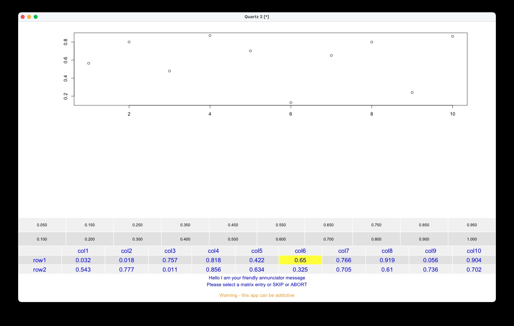
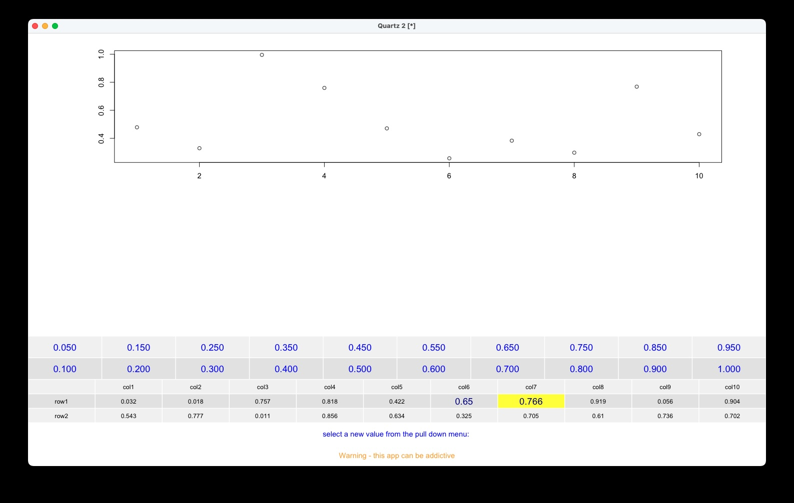
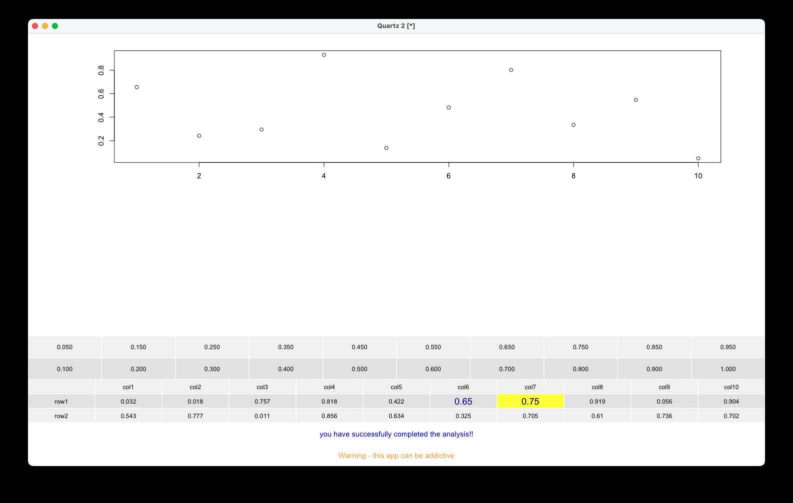

<b style='mso-bidi-font-weight:
normal'>Implement tableGrob Object as a Clickable Image Map<o:p></o:p></b>

<b style='mso-bidi-font-weight:
normal'><o:p>&nbsp;</o:p></b>

<b style='mso-bidi-font-weight:
normal'><o:p>&nbsp;</o:p></b>

<b style='mso-bidi-font-weight:
normal'>Barry
Zeeberg<o:p></o:p></b>

<b style='mso-bidi-font-weight:
normal'>barryz2013@gmail.com<o:p></o:p></b>
 

I am in the process of completing a fairly large project that includes interactive modification of numerical values in a table in response to information presented in associated graphics.
 

Initially, I used the edit() function to present the user with the table of values. However, upon testing the system, (1) it was frustrating that there was no control over the position of the table relative to the multiple graphical depictions. (2) In addition, there was no control over the size of the table, or its appearance, or the size and type of font. (3) Finally, using the edit() function requires the user to access the keyboard in order to modify a value - but I wanted to avoid the inconvenience of switching between mouse and keyboard. I decided that it would be more convenient for the user to stick with the mouse for all interactions. Consequently, I developed an integrated environment that replaces the edit() function. Here is a brief [YouTube video](https://www.youtube.com/watch?v=g2UiIKLZk8c&ab_channel=BarryZeeberg) that provides an overview and an example of using the integrated environment.
 

It may be important to annotate the reasons for making a modification in a numerical value, and to archive the annotations. In keeping with the mouse-only philosophy, I recommend using a third-party program like QuickTime Player to make a screen recording of the process. This has the advantage of allowing the user to make a *voice* annotation (that is, there is no need to switch your hands between the mouse and the keyboard) in conjunction with a video recording, thus registering any modification with an explanation. The exact procedure is presented in the Appendix at the end of this document.
 

If the table were implemented as a grob recognized by ggplot, then it could be controlled by the gtable and associated packages. This would allow the table to be optimally, reproducibly, and stably positioned relative to the other informational grobs.
 

In addition to generating the table as a grob, it also needed to be implemented as a clickable imagemap, to allow the user to select and modify the value in a cell. The best option for this task appeared to be the grid.locator() function. The coordinates returned by grid.locator() need to be independently related to the positions within the enclosing grob. The most straightforward and reliable method seemed to be to use the positions of the upper left and lower right corners of the table grob to calibrate the grid.locator() user clicks with the cells of the table.
 

The visual representation of the modified value in the table is implemented by modifying the underlying matrix, and redrawing it. What the user sees is identical to the information that is internal to the program. Any internal computations are performed with the same values as the user is viewing.
 

The overall layout of the demo gtable (Figure 1) illustrates the general
design principles that a designer can implement to achieve a custom design. The 2 top rows can be used to display data such as graphs or tables that the user can refer to while updating the table in the fourth row. The data in these top 2 rows can change dynamically or can remain static.
 

The fourth row contains a data table, that is the data that will be manually modified by the user upon examination of the information in the top 2 rows.
The third row can accomodate a "pull down menu" - that is, a matrix of values that can be selected and inserted to update the data matrix in the fourth row.
The next 2 rows contain the annunciator and warning/error messages.
 

{width=150%}

The layout can be easily customized to accomodate an alternative configuration. Here is the relevant code segment: 

    rows<-c(.35,.35,.1,.1,.05,.05)
    
    if(sum(rows)!=1)
      stop("sum of rows must equal 1")
      
    names(rows)<-c("scatterPlotRow","notUsedRow",
      "pullDownRow","ptabRow","annunciatorRow",
      "warningRow")

The program is invoked by: 

    clickableImageMapDemo(2)

The populated screen (Figure 2) exhibits the demo components described above. The annunciator initially prompts the user to select a table entry, and the elements of the table are highlighted to guide focus the user's attention to the correct area.
 

If the user does not wish to modify any values in this phase of the analysis, s/he can click on the word "SKIP" in the annunciator message, and go on to the next phase of the analysis. If the user wishes to abort the entire analysis, s/he can click on the word "ABORT" in the annunciator message.
 

{width=150%}

After the table entry has been selected, it is displayed in a larger font size and highlighted in yellow (Figure 3). In addition, the elements of the pull down menu are highlighted to become the focus of attention for the user's next selection of the replacement value.
 

{width=150%}

After the selection of the replacement value has been made, it replaces the original table value (Figure 4), and the annunciator prompts the user to select an additional table value to be replaced.
  

{width=150%}

As a reminder of which values have been replaced so far, the font size is slightly increased (Figure 5). The current value is additionally highlighted with a yellow background.
 

{width=150%}

Finally the second replaced value appears (Figure 6), and the annunciator confirms that the analysis has been succesfully completed.
 

{width=150%}
  
<b style='mso-bidi-font-weight:
normal'>Appendix: Using QuickTime Player to Make an Audio-Visual Screen Recording of the Process<o:p></o:p></b>

I have validated this procedure on a Mac Mini, but I expect that a similar procedure would apply to other models.
 

(1) Plug an external microphone into the appropriate port in the back of the unit. 
 

(2) In the Sound Panel of System Settings, select External Microphone as the Input Device. You can check that this is working correctly by watching the Input Level Monitor as you speak into the mic.
 

(3) Click on the icon to open QuickTime Player.
 

(4) In the QuickTime Player File menu, select New Screen Recording. 
 

(5) In the Save To pane of the Options panel, select Other Location. 
 

(6) Navigate to the desired location for saving the annotation video. 
 

(7) In the Microphone pane of the Options panel, select External Microphone. 
 

(8) Select Record Entire Screen. 
 

(9) Click Record to start recording. 
 

(10) When finished, click the icon (looks like a little white square with an inscribed dark circle) in the menu bar (near the right side at the very top of the monitor) to finish recording. 
 
